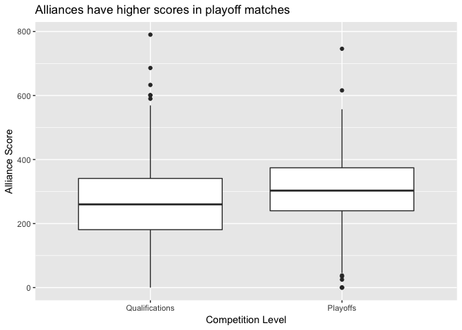
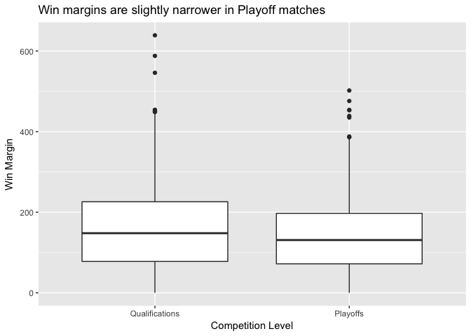

Week Two Match Analysis Using the TBA API and R
================
Greg Marra
3/8/2018

FIRST® POWER UPS℠ is turning out to be a very interesting game! In this blog post, we'll use (The Blue Alliance API)\[<https://www.thebluealliance.com/apidocs/>\] and the R programming language to analyze the 2105 matches played so far this year.

*The code that generated this blog post is available on my github at <LINK>. Fork it, load it up in (RStudio)\[<https://www.rstudio.com/>\], and try it out! If you want to learn more about using R to do data science, I recommend ("R for Data Science" by Hadley Wickham and Garrett Grolemund)\[<http://r4ds.had.co.nz/>\], which is available for free online.*

Match Scores
------------

The chart above is a boxplot, which shows the minimum, 25th percentile, median, 75th percentile, and maximum of the non-outlier values, with the outliers as dots. Unsurprisingly, scores are higher in playoff matches than in qualification matches.

Looking at win margins, we see that the median win margin in qualification matches is 143 while the median win margin in playoff matches is only 143, 14.5 points lower!

How to Win
----------
